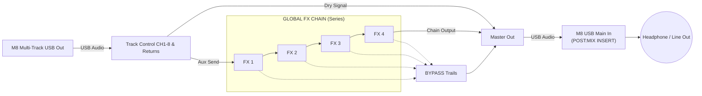

# M8FX User Manual

  <iframe width="560" height="315" src="https://www.youtube.com/embed/qeHBCHznzzk" frameborder="0" allow="accelerometer; autoplay; clipboard-write; encrypted-media; gyroscope; picture-in-picture" allowfullscreen></iframe>

## 1. Introduction
M8FX is a multi-track effects board application designed exclusively for the Dirtywave M8 Tracker.
It receives multi-track audio from the M8 via USB, allowing you to intuitively control track mutes, solos, and auxiliary sends to external effects (AUv3 plugins) with a touch-friendly interface. It features a UI specialized for live performances and real-time sound design.

---

## 2. System Concept & Signal Flow
The audio signal routing between the M8 hardware and the M8FX app flows as follows:

1. **USB Audio In**: Multi-track audio (CH1–8) and return channels (MOD/DLY/REV) are received from the M8 via USB audio.
2. **Track Control**: Mutes and solos for CH1–8 and return channels are controlled directly within M8FX.
3. **Aux Sends**: Audio from each channel can be routed (sent) to the "GLOBAL FX CHAIN (FX 1–4)" at any time.
4. **Global FX Chain**: Up to four AUv3 plugins are routed in **series**, processing the sent audio sequentially.
5. **ON / BYPASS (Trails)**: When an effect is set to "ON", the audio flows through it and continues down the serial chain. When bypassed, the effect is removed from the main processing chain (allowing audio to pass through unaffected). However, any lingering effect tails (such as reverb or delay trails) are routed directly to the **Master Out**, ensuring that trails fade out naturally without being abruptly cut off or processed by subsequent effects.
6. **Return to M8 (Master Out)**: The final mixed 2-channel audio from M8FX (Master Out) is routed **back into the M8** via USB. Because the M8 is configured with `USB MAIN OUT` set to `POST:MIX INSERT` during setup, the M8 hardware will output this fully processed audio from the app as its final master mix (e.g. directly to your headphones).

---

## 3. Setup Guide

### M8 Hardware Settings
1. Connect the M8 directly to your iPhone/iPad (or other iOS devices) using a USB-C cable. (*Note: For older iPhones/iPads with a Lightning port, an official Apple "Lightning to USB Camera Adapter" is required.*)
2. In the M8 settings menus, apply the following audio and MIDI configurations:
   - **USB AUDIO MODE**: `MULTICHANNEL` (System settings)
   - **USB MAIN OUT**: `POST:MIX INSERT` (System settings)
   - **SEND SYNC**: `ON` (Located in PROJECT > MIDI SETTINGS. *Required* to sync the BPM to the app. You must enable this per-project, or use 'Save Default Settings'.)

### App Settings
1. Launch the M8FX app.
2. On the first launch, you will be prompted for **Microphone Access**. This is strictly required to receive USB audio from the M8. Please ensure you tap "Allow." (No audio will be received until permission is granted).
3. Tap the **"I/O"** button in the top right corner to open the Audio Settings.
4. Set your Input to the M8's USB Audio, and your Output to your device's speakers or audio interface.
5. Setup is complete when you see "M8 CONNECTED" in the bottom left corner and the waveforms start responding to the input signal.

---

## 4. Use Cases

- **Live Performance Dub Effects**:
  Send specific tracks (e.g., snare or synth) to effects (FX1–4) instantly using "MOMENTARY" mode to create dynamic, real-time dub echoes and transitions.
- **Sound Design with Custom Effects**:
  Expand the M8's sound palette by utilizing powerful third-party AUv3 effects (such as granular processors, unique delays, or distortions) not available natively on the hardware.
- **Intuitive Mute & Solo Control**:
  Execute dynamic track arrangements using multi-touch mute and solo controls faster than physical hardware limits allow.

---

## 5. Controls & UI Gestures

The M8FX UI is optimized for multi-touch interactions, typical of smartphones and tablets (functioning best on touch-enabled displays).

- **Multi-Touch Support**: Operate multiple faders, mute buttons, and send buttons simultaneously using several fingers.
- **Page Toggle (CH 1-8 / RETURNS)**: Tap the `CH 1-8 >` or `< RETURNS` button on the middle right of the screen to instantly switch between the main 8 tracks and the return channels (MOD/DLY/REV).
- **MACRO Sliders**: Drag the `MACRO SLIDERS` (M1–M4) up and down to smoothly control the assigned effect parameters.

---

## 6. Feature Reference

### Top Header
- **BPM**: Displays the current BPM synchronized to the M8's MIDI clock, flashing in time with the beat.
- **SEND (LATCH / MOM)**: Toggles the behavior of the effect send when tapping a channel.
  - `LATCH`: Toggles the effect ON/OFF with each tap. (Useful for leaving an effect on permanently).
  - `MOM (Momentary)`: The effect remains ON only while the channel is being held. (Ideal for rhythmic dub throws).
- **RST / ALL SEL**: 
  - `RST`: If any channel has an active effect or mute, a single tap resets all channels to a clean (OFF) state.
  - `ALL SEL`: If all channels are in a clean state, tapping this turns ON the effect sends for every channel simultaneously.
- **I/O**: Opens the audio device settings menu.
- **FX**: Opens the "FX Settings" menu to load AUv3 plugins and assign MACROs.

### Channel Strips
- **Level Meters**: The background color and height dynamically change based on incoming audio, providing a visual representation of levels.
- **M (Mute) / S (Solo)**: Toggles mute and solo for the track.
- **Channel Area Tap**: Sends audio to the currently selected effect (FX1–4) based on the current `SEND` mode. The channel highlights while sending.

### GLOBAL FX CHAIN
- **FX 1 – 4**: Displays the name of the loaded effect. Tapping the name opens the plugin's dedicated UI window.
- **ON / BYP**: Toggles the bypass state for the effect itself.
- **Selection Box**: Tapping the `FX 1` title selects that effect slot, assigning the MACRO sliders below to control it.

### FX Settings Menu
- Load your preferred AUv3 plugin into any of the 4 effect slots (FX 1–4).
- Use the dropdown menus to freely assign any parameter of a loaded plugin to the MACRO sliders (M1–M4).

---

## 7. Troubleshooting (FAQ)

**Q. My M8 is connected, but there is no sound and waveforms aren't moving.**
A. The app requires "Microphone Access" to receive external USB audio from the M8. If you missed the prompt or accidentally denied it, go to your iOS "Settings" app > "Privacy & Security" > "Microphone" and toggle the switch ON for M8FX.

**Q. I can't select the M8 in the I/O settings.**
A. The USB audio output might be disabled on the M8. Verify the system settings on your M8 hardware, try reconnecting the cable, and restart the app.

**Q. An AUv3 plugin I installed isn't showing up in the list.**
A. The app scans for installed AUv3 plugins upon launch. If you just installed a new plugin, try restarting the M8FX app.

**Q. The effect's UI window (OPEN UI) won't open.**
A. You cannot open the UI if the plugin slot is set to "None" in the FX Settings. Select a valid AUv3 plugin first.

---

## 8. Limitations & Notes

- **Supported Plugin Formats**: M8FX currently only supports **AUv3 (Audio Unit v3)** plugins. Formats like VST3 are not supported.
- **Slot Limits**: A maximum of 4 effects can be loaded simultaneously in the GLOBAL FX CHAIN.
- **CPU Load**: Loading multiple CPU-intensive AUv3 plugins may cause audio dropouts. If this happens, try increasing the "Audio Buffer Size" in the I/O settings.
- **iOS Device Specifications**: The latest USB-C equipped iPhones/iPads can connect with a single cable. Devices with a Lightning port (iPhone 14 and earlier) require an official Apple Camera Adapter. Additionally, due to iOS security requirements, the app may require a restart after granting microphone permissions on the first launch.

---

## 9. Contact & Support

If you have any questions, bug reports, or feedback, please feel free to contact the developer at:
[ca54makske+m8fx@gmail.com](mailto:ca54makske+m8fx@gmail.com)

<!-- GitHub Pages Mermaid setup -->

