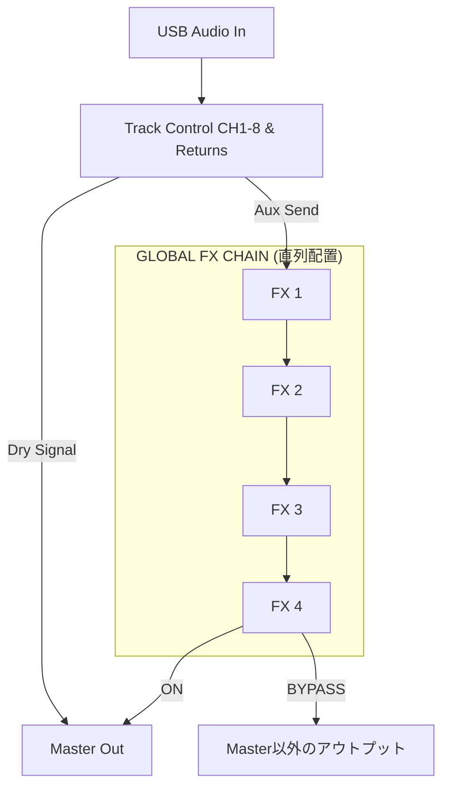

# M8FX ユーザーマニュアル

## 1. 概要 (Introduction)
M8FXは、Dirtywave M8 Tracker専用のマルチトラック・エフェクトボードアプリケーションです。
M8からUSB経由でマルチトラックオーディオを受信し、アプリ内で各チャンネルのミュート、ソロ、および外部エフェクト（AUv3プラグイン）へのセンドをタッチパネル感覚で直感的にコントロールできます。ライブパフォーマンスやリアルタイムでのサウンドデザインに特化したUIを備えています。

---

## 2. システム概念・シグナルフロー (Signal Flow)
M8本体とM8FXアプリ間の音声信号は以下のような流れで処理されます。

1. **USB Audio In**: M8からUSBオーディオ経由で、各トラック（CH1〜8）およびリターン（MOD/DLY/REV）のパラアウト音声を受信します。
2. **Track Control**: M8FX上でCH1〜8、およびリターンチャンネルのミュート、ソロをコントロールします。
3. **Aux Sends**: 各チャンネルから任意のタイミングで「GLOBAL FX CHAIN (FX 1〜4)」へ音を分岐（センド）できます。
4. **Global FX Chain**: 最大4つのAUv3プラグイン（エフェクト）が**直列（シリーズ）**で配置されており、センドされてきた音声を順番に加工します。
5. **Master Out / Bypass Out**: FXチェーンを通過した最終的な音声は、状態が「ON」のときはメインのMaster Outへミックスされますが、「BYPASS」のときはMasterとは別のアウトプットへルーティングされます。

---

## 3. 初期セットアップ (Setup Guide)

### M8本体の設定
1. M8をiPhone/iPad等のiOSデバイスにUSB-Cケーブルで直接接続します。（※Lightning端子搭載の古いiPhone/iPadをご利用の場合は、Apple純正の「Lightning - USBカメラアダプタ」等が別途必要です）
2. M8本体の設定画面から、以下のオーディオ設定に変更してください。
   - **USB AUDIO MODE**: `MULTICHANNEL`
   - **USB MAIN OUT**: `POST:MIX INSERT`

### アプリ側の設定
1. M8FXアプリを起動します。
2. 初回起動時に**「マイクへのアクセス」**を求められます。USB経由でM8の音声を受信するために必須となりますので、必ず「許可」を選択してください。（許可するまで音声は入力されません）
3. 画面右上の **「I/O」** ボタンをタップし、Audio Settings画面を開きます。
4. InputにM8のUSB Audio、Outputにスピーカーやオーディオインターフェースを指定します。
5. 画面左下に「M8 CONNECTED」と表示され、入力信号に合わせて波形が動いていれば準備完了です。

---

## 4. 利用シーン (Use Cases)

- **ライブパフォーマンスでのダブ・エフェクト処理**:
  特定のトラック（例えばスネアやシンセ）を「MOMENTARY」モードで瞬時にエフェクト（FX1〜4）へ送り、トビ音などの効果をリアルタイムに演出します。
- **カスタムエフェクトを用いたサウンドデザイン**:
  M8本体には搭載されていない強力なサードパーティ製AUv3エフェクト（グラニュラー、特殊ディレイ、歪みなど）を活用し、M8のサウンドをさらに拡張します。
- **直感的なミュート・ソロ操作**:
  ハードウェア以上の素早さで複数のトラックのミュート/ソロをタッチ操作し、楽曲の展開をダイナミックに作ります。

---

## 5. 操作ガイド・ジェスチャー (Controls & UI)

M8FXのUIは、スマートフォンやタブレットのようなマルチタッチ操作に最適化されています。（タッチパネル対応ディスプレイで最大限に機能を発揮します）

- **マルチタッチ対応**: フェーダー、ミュートボタン、センドボタンなどを複数の指で同時に操作することが可能です。
- **画面切り替え (CH 1-8 / RETURNS)**: 画面中央右側の `CH 1-8 >` または `< RETURNS` ボタンをタップすることで、メインの8トラックと、リターンチャンネル（MOD/DLY/REV）の画面を瞬時に切り替えることができます。
- **MACROスライダー**: `MACRO SLIDERS`（M1〜M4）は上下にドラッグすることで、割り当てられたエフェクトのパラメータを滑らかに操作できます。

---

## 6. 機能詳細 (Feature Reference)

### トップヘッダー
- **BPM**: M8からのMIDIクロックに同期して現在のBPMを表示し、拍に合わせて点滅します。
- **SEND (LATCH / MOM)**: 各チャンネルを押した際のエフェクトセンドの挙動を切り替えます。
  - `LATCH`: タップするごとにON/OFFが切り替わります。（常時エフェクトをかけたい場合に有効）
  - `MOM (Momentary)`: 押している間だけエフェクトがONになります。（ダブミックスの「飛ばし」に最適）
- **RST / ALL SEL**: 
  - `RST`: いずれかのチャンネルでエフェクトやミュートがONになっている場合、ワンタップですべてのチャンネルをクリーン（OFF）な状態にリセットします。
  - `ALL SEL`: すべてのチャンネルがクリーンな状態のときに押すと、一括で全チャンネルのエフェクトをONにします。
- **I/O**: オーディオデバイスの設定画面を開きます。
- **FX**: 「FX Settings」画面を開き、ロードするAUv3プラグインやMACROの割り当てを設定します。

### チャンネルストリップ
- **レベルメーター**: 音声が入力されると背景の色と高さが変わり、視覚的に入力レベルを確認できます。
- **M (Mute) / S (Solo)**: トラックのミュート・ソロを切り替えます。
- **チャンネル枠全体のタップ**: `SEND`のモードに従って、設定されているエフェクト（FX1〜4）へ音をセンドします。センド中は枠がハイライトされます。

### GLOBAL FX CHAIN
- **FX 1 〜 4**: エフェクトの名前が表示されます。名前部分をタップすると、そのプラグイン専用のUIウィンドウが開きます。
- **ON / BYP**: エフェクト自体のバイパス（無効化）を切り替えます。
- **選択枠**: `FX 1` などのタイトル部分をタップするとそのFXが選択され、下部のMACROスライダーの操作対象がそのFXに切り替わります。

### FX Settings 画面
- エフェクトスロット（FX 1〜4）ごとに読み込むAUv3プラグインを選択できます。
- 各FXに対して、MACRO M1〜M4の各スライダーで「どのパラメータを動かすか」をプルダウンから自由にアサイン（割り当て）できます。

---

## 7. トラブルシューティング (FAQ)

**Q. M8を接続しているのに音が出ない・波形が反応しない**
A. 外部入力（M8のUSB Audio）をアプリが受信するために「マイクのアクセス許可」が必要です。許可ダイアログを見逃してしまった場合や誤って拒否してしまった場合は、iOSの「設定」アプリ >「プライバシーとセキュリティ」>「マイク」から M8FX アプリのスイッチをオンにしてください。

**Q. I/O設定でM8が選べない**
A. M8側の設定でUSBオーディオ出力が無効になっている可能性があります。M8本体のシステム設定を確認し、ケーブルの再接続とアプリの再起動をお試しください。

**Q. 追加したはずのAUv3プラグインが一覧に出ない**
A. アプリは起動時にシステムにインストールされているAUv3プラグインをスキャンします。プラグインをインストールした直後の場合は、一度アプリを再起動してみてください。

**Q. エフェクト画面（OPEN UI）が開かない**
A. FX Settingsでプラグインが「None」になっている場合は開けません。有効なAUv3プラグインを選択してから試してください。

---

## 8. 制限事項・注意事項 (Limitations & Notes)

- **対応プラグインフォーマット**: M8FXは現在 **AUv3 (Audio Unit v3)** 形式のプラグインのみをサポートしています。VST3などの形式は読み込むことができません。
- **スロット数の上限**: GLOBAL FX CHAINで読み込めるエフェクトは最大4つまでとなっています。
- **CPU負荷**: 重いAUv3プラグインを複数立ち上げると、オーディオのドロップアウト（音飛び）が発生する場合があります。その際は I/O 設定からバッファサイズ（Audio Buffer Size）を少し大きめに設定してください。
- **iOSデバイスの仕様**: 最新のUSB-C搭載iPhone/iPadではケーブル1本で接続可能です。Lightning端子搭載の機種（iPhone 14以前など）では、Apple純正のカメラアダプタが必要です。また、セキュリティ要件により初回起動時のマイク許可後にアプリの再起動が必要になる場合があります。

---

## 9. お問い合わせ (Contact & Support)

ご質問やバグ報告、フィードバックなどがございましたら、以下のメールアドレスまでお気軽にご連絡ください。
[ca54makske+m8fx@gmail.com](mailto:ca54makske+m8fx@gmail.com)
